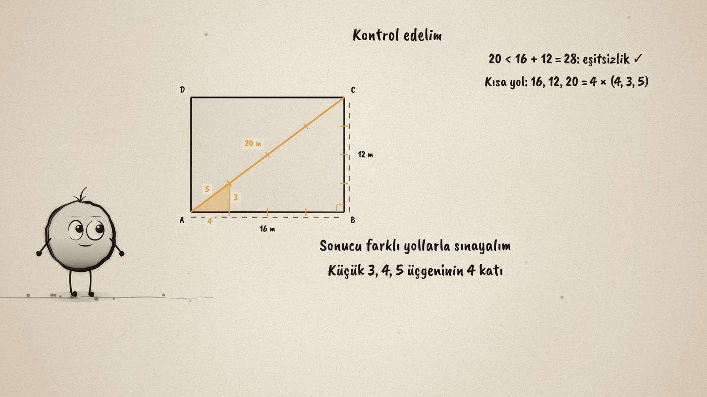
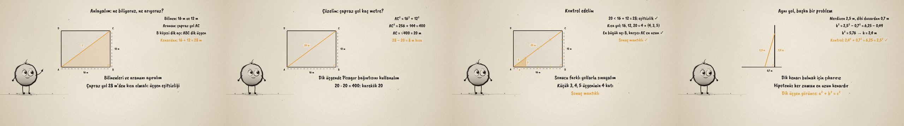

# Kestirme Yol · The Shortcut

**▶ Tarayıcıda izleyin / Watch in the browser:** https://hakanatas.github.io/kestirme-yol/ 
**⬇ MP4 + altyazılar / MP4 + subtitles:** [Releases](https://github.com/hakanatas/kestirme-yol/releases) 
**✎ Kullanılan istem / The prompt behind it:** [PROMPT.md](PROMPT.md) 
**🎞 Bütün filmler / All films:** [Nokta'nın Filmleri](https://hakanatas.github.io/nokta-filmleri/?sinif=8)

> **TR —** 8. sınıf matematik "Geometrik Şekiller" temasındaki MAT.8.3.6 öğrenme çıktısı için hazırlanmış, tamamen JavaScript ile çizilen 92 saniyelik mürekkep animasyonu. 16 m'ye 12 m'lik bir parkın bir köşesinden karşı köşesine: kenarlardan mı yürüyelim, çaprazdan mı? Önce bilinenler ve aranan ayrılıyor; B köşesi dik açı olduğu için ABC bir dik üçgen ve üçgen eşitsizliğine göre çapraz yol 28 m'den kısa olmalı. Pisagor bağıntısıyla AC² = 256 + 144 = 400, AC = 20 m: kestirme 8 m kısa. Sonuç üçgen eşitsizliği, açı-kenar ilişkisi ve 3, 4, 5 üçgeninin 4 katı olma kısa yoluyla kontrol ediliyor. Aynı strateji bir merdiven problemine genelleniyor: h² = 2,5² − 0,7², h = 2,4 m. Altyazılar Türkçe, İngilizce ya da ikisi birlikte seçilebilir.

A 92-second ink animation for **8th-grade maths**. Nokta, the ink character from [The Learning Ink](https://github.com/hakanatas/the-learning-ink), is the guide again. The film follows the problem-solving steps of the outcome in order: understand, represent, solve, check, look for a shortcut, then use the same strategy on a new problem.

## Learning outcome

MEB, Türkiye Yüzyılı Maarif Modeli, Ortaokul Matematik, 8th grade, "Geometrik Şekiller" theme:

**MAT.8.3.6. Üçgende açı-kenar ilişkisi, üçgen eşitsizliği ve Pisagor bağıntısını içeren problemleri çözebilme**
- a) Üçgende açı-kenar ilişkisi, üçgen eşitsizliği ve Pisagor bağıntısını içeren problemlerde ilgili matematiksel bileşenleri (açıların ölçüsü, kenarların uzunluğu, şekil gibi) belirler.
- b) Matematiksel bileşenler arasındaki ilişkileri belirler.
- c) Problem bağlamındaki temsilleri farklı temsillere dönüştürür.
- ç) Matematiksel temsillere dönüştürdüğü problemi kendi ifadeleri ile açıklar.
- d) Problemin çözümünü gerçekleştirmek için stratejiler geliştirir.
- e) Belirlenen stratejileri çözüm için uygular.
- f) Çözüm yollarını kontrol eder ve çözüme ulaştırmayan stratejiyi değiştirir.
- g) Problemin çözümü için kullandığı stratejileri gözden geçirerek kısa yolları değerlendirir.
- ğ) Kullandığı strateji veya stratejileri farklı problemlerin çözümlerine geneller.
- h) Genellemenin geçerliliğini matematiksel örneklerle değerlendirir.

## Scenes

| # | Time | Scene | What happens | Outcome |
|---|---|---|---|---|
| 1 | 0–10 s | Park | From one corner to the opposite one: along the edges or across? | a |
| 2 | 10–28 s | Anla | 16 m and 12 m are known, AC is wanted; B is a right angle; the diagonal must be under 28 m. | a, b, c, ç |
| 3 | 28–46 s | Çöz | AC² = 16² + 12² = 400, AC = 20 m: 8 m shorter. | d, e |
| 4 | 46–64 s | Kontrol | Triangle inequality, the largest angle faces the longest side, and 4 × (4, 3, 5). | f, g |
| 5 | 64–80 s | Merdiven | The same strategy for a ladder: h² = 2.5² − 0.7², h = 2.4 m. | ğ, h |
| 6 | 80–92 s | Özet | Understand, find the right triangle, calculate, check. | a–h |

## Running it

- **Preview:** double-click `index.html` (it works offline).
- **MP4:** run `npm install` once, then `npm run export -- --format=horizontal --captions=tr`.
- **Subtitles and narration:** `npm run srt` writes `out/captions_*.srt` and `narration_notes.txt`.
- **Editing:**
  - Caption text, timings and narration notes: `captions.js`
  - Everything on screen is drawn by `LI.world(t)` in `scenes/scene1.js` (the park, the diagonal, the ladder, the words); the other scenes only set the camera.
  - Nokta's poses: `src/draw/film.js`; layout for 16:9 and 9:16: `src/draw/kd.js`

It uses the same engine as The Learning Ink: `renderFrame(t)` as a pure function of time, seeded randomness, and frame-by-frame export.

## Lisans · License

**TR —** Bu film ve kodu [Creative Commons Atıf-GayriTicari 4.0 Uluslararası (CC BY-NC 4.0)](https://creativecommons.org/licenses/by-nc/4.0/deed.tr) lisansıyla paylaşılır. Ticari olmayan her amaçla (derste, okulda, eğitim materyalinde) kopyalayabilir, paylaşabilir ve değiştirebilirsiniz; ancak **kaynak göstermek zorunludur**: eser sahibinin adı ve bu deponun bağlantısı belirtilmeden kullanılamaz. Ticari kullanım (satış, ücretli ürün ya da yayın) için izin alınmalıdır.

**EN —** This film and its code are licensed under [Creative Commons Attribution-NonCommercial 4.0 International (CC BY-NC 4.0)](https://creativecommons.org/licenses/by-nc/4.0/). You may copy, share and adapt them for non-commercial purposes, but **attribution is required**: they may not be used without crediting the author and linking to this repository. Commercial use requires permission.

Atıf örneği / Required credit: *“Kestirme Yol”, Hakan Ataş, Nokta'nın Filmleri — https://github.com/hakanatas/kestirme-yol — CC BY-NC 4.0*
